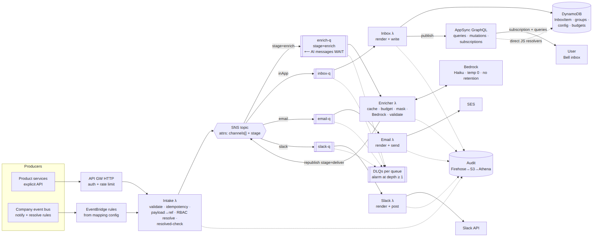

# Central Notification Service — System Design v1.4

**Status:** Authoritative. This document supersedes `CNS-System-Design.docx` (v1.3), which is kept for history.
**Date:** July 2026
**Diagrams:** sources in [`../diagrams/`](../diagrams/) (Mermaid `.mmd` + rendered `.png`)

---

## 1. What changed in v1.4 (vs. v1.3)

v1.4 has one theme: **the simplest architecture that still meets every requirement**, plus two functional changes — AppSync replaces the entire custom in-app stack, and AI enrichment becomes a **gate**: an AI-enriched notification *waits in the AI pipeline and is never delivered to the client before enrichment completes*.

| v1.3 component | v1.4 — where it went |
|---|---|
| Router λ (+ route-q) | **Deleted.** Its irreducible jobs (RBAC recipient resolution, resolved/episode guard) moved into the single **Intake λ**; the routing half of its job is now **SNS message-attribute filtering** — `NotificationType.channels[]` becomes message attributes, channel queues subscribe with filter policies. Routing is configuration, not code. |
| Renderer λ | **Deleted.** Each channel λ renders its own channel's template with a shared template library. Rendering is channel-specific anyway (email body ≠ inbox card ≠ Slack blocks). |
| Inbox REST API + API Gateway WebSocket + connection-registry table | **Replaced by one AppSync GraphQL API** — queries, mutations, and real-time subscriptions in a single managed surface. AppSync manages every connection; the registry table, sync-on-connect plumbing, and the reconnect-storm risk (v1.3 risk R8) are gone. |
| Progressive-enhancement enrichment (baseline v1 delivered ≤1.5 s, AI upgrades to v2 in place; email holds 4 s; 60 s upgrade window; max-age discard) | **Replaced by the AI gate.** AI-type messages wait in `enrich-q`; **no channel ever sees them before enrichment succeeds**. The `contentVersion` v1/v2 machinery, the email-hold window, and the upgrade-window valve are all deleted — there is exactly one version of the content, identical on every channel. |
| Two full alternative architectures (A: serverless mesh, B: EKS + Kafka), iteration logs, pillar scoring | The doc now describes **one solution**. Solution B survives as a one-page scale-up appendix ([Appendix A](#appendix-a--scale-up-evolution-kafka--eks)) with explicit revisit triggers. |

What did **not** change: the canonical envelope, producer API, idempotency, `tenant#user` key design + IAM-level isolation, TTL / read-to-dismiss / group resolution, the unread counter, the audit contract, PII handling, and the DR posture. They are summarized here and remain as specified in v1.3 where noted.

---

## 2. Executive summary

**Goal.** One Central Notification Service (CNS): any backend hands it a notification — explicitly via API or implicitly via the company event bus — and CNS resolves recipients, delivers through the configured channels (in-app Bell inbox, email, Slack; more addable later), keeps a full audit trail, and optionally enriches the message with AI. Hard multi-tenant isolation, zero silently dropped events, and per-type lifecycle (TTL, read-to-dismiss, group resolution) are first-class requirements.

**Shape.** The entire pipeline is **one intake Lambda, one SNS topic, and one Lambda per channel**:

```
Producers (API GW HTTP | EventBridge rules)
   → Intake λ   validate · idempotency · payload→payloadRef · RBAC resolve · resolved-check
   → SNS topic  message attributes: channels[] (from NotificationType config) + stage
        stage=enrich   → enrich-q (SQS) ⟵ AI messages WAIT here — no channel sees them
                          → Enricher λ → republish stage=deliver (+ enriched fields)
        stage=deliver  ├→ inbox-q   → Inbox λ    (render + DynamoDB write + AppSync publish)
                       ├→ email-q   → Email λ    (render + SES)
                       ├→ slack-q   → Slack λ    (render + Slack API)
                       ├→ webhook-q → Webhook λ  (render + HMAC-sign + POST to tenant endpoint)
                       ├→ push-q    → Push λ     (device lookup + APNs / FCM)
                       └→ sms-q     → SMS λ      (consent check + segment + SMS provider)
```

Six channels ship in v1.4: **in-app, email, Slack** (original) and **webhook, mobile push, SMS** (§3.6). Every one is the same shape — an SQS queue with an SNS filter policy, an adapter Lambda, its own retry policy and DLQ, and a template column — so the pipeline itself never changed to add three channels. That is the extensibility seam ADR-1 exists to provide.

**NFR anchors.** Sustained 10,000 notifications/min (~167/s), bursts to 50,000/min (~833/s); no silent drops (DLQ per queue, depth-0 steady state, alarms otherwise); hard tenant isolation; producer `eventId` idempotency; PII never in logs.

**SLOs (v1.4 split).**

| Type | In-app producer→visible | Email handoff |
|---|---|---|
| Non-AI types (~95 % of volume) | p99 ≤ 1.5 s | p99 ≤ 5 s |
| AI-enriched types (opt-in per type) | p99 ≤ 10 s — **explicit, documented trade-off**: enrichment is on the delivery path by requirement | p99 ≤ 10 s |

---

## 3. Component walkthrough



**Sequence diagrams** (sources in [`../diagrams/`](../diagrams/)): `f1_explicit` (explicit single-user), `f2_fanout` (bus fan-out + implicit resolve), `f3_enrichment` (the AI gate), `f4_inbox` (AppSync read/resolve), `f5_triage` (AI event triage), `f6_counter` (unread-counter ladder), `f7_webhook`, `f8_push`, `f9_sms` (the three new channels, §3.6), `f10_login_to_inbox` (full flow: login → JWT → subscribe → device register → notification → Bell, §7), and `f11_resolve_race` (fan-out resolved mid-flight — a recipient is **never** notified, §7).

### 3.1 Intake λ — the only place events enter

One Lambda, two triggers:

- **Explicit:** API Gateway HTTP `POST /v1/notifications` (service auth: SigV4/OAuth2; `tenantId` extracted server-side from the caller's claim — never trusted from the body).
- **Implicit:** EventBridge rules generated from the mapping table (`notify` and `resolve` mappings — unchanged from v1.3 §9.2, including shadow-mode deploys).

Per event it: (1) validates against the per-type JSON Schema; (2) performs idempotency with a conditional put of `tenant#eventId` (TTL 48 h) — duplicates return `202 {duplicate:true}`, so producers retry blindly and safely; (3) stores the payload once, encrypted under the tenant-tier CMK, so messages carry an opaque `payloadRef`, never PII; (4) resolves recipients — `user` passes through, `role@org` goes to the cached RBAC client (fresh ≤ 60 s, stale-while-revalidate ≤ 10 min); (5) runs the **resolved-check / episode guard** for resolvable types (trigger `eventTime ≤ resolvedAt` ⇒ suppressed as duplicate, audited); (6) **publishes to SNS and only then ACKs** — durable-publish-before-ack is what makes "no silent drops" mechanical.

If RBAC is down beyond the staleness bound: the API path returns 5xx (the producer's blind retry is safe via idempotency); the bus path relies on Lambda retry → DLQ + alarm. CNS never guesses membership.

Fan-out is chunked: recipients ride the message in chunks of ≤ 500, so a 5,000-recipient event is 10 messages; above the 5,000 cap the event is split into paced waves (everyone is still notified; an over-cap alarm tells product which types outgrew their audience).

### 3.2 SNS topic — routing as configuration

Each published message carries attributes taken directly from config: `channels` (from `NotificationType.channels[]`, e.g. `["inApp","email"]`), `stage` (`enrich` for AI types, `deliver` otherwise), `typeId`, `tenantId`.

Subscriptions are SQS queues with **filter policies**:

| Queue | Filter policy |
|---|---|
| `enrich-q` | `stage = enrich` |
| `inbox-q` | `stage = deliver AND channels contains inApp` |
| `email-q` | `stage = deliver AND channels contains email` |
| `slack-q` | `stage = deliver AND channels contains slack` |
| `webhook-q` | `stage = deliver AND channels contains webhook` |
| `push-q` | `stage = deliver AND channels contains push` |
| `sms-q` | `stage = deliver AND channels contains sms` |

Consequences: adding a channel is a new queue + λ + filter policy — zero pipeline change (the webhook, push, and SMS rows above were literally added without touching intake, SNS, or any other adapter); a Slack outage cannot touch email or in-app latency (per-queue isolation, retry policy, and DLQ); and **AI-type messages are structurally invisible to channel queues** until the Enricher republishes them with `stage=deliver` — the "wait" is enforced by topology, not by discipline.

### 3.3 Channel λs — render + deliver, one per channel

Each channel λ renders its own template (shared library; Mustache-strict — an unknown variable is a render error → DLQ, never a blank message) and delivers:

- **Inbox λ:** `TransactWriteItems` — conditional `PutItem` on `notifId` (idempotent) + `ADD unread_ctr +1` — then publishes the item to **AppSync** (IAM-authorized mutation), which fans out to the user's live subscriptions. 5,000-recipient worst case ≈ 200 batch calls ≈ under 2 s.
- **Email λ:** outbox `DeliveryRecord` conditionally created before send (`sending → sent`), SES v2 with `X-CNS-Notif-Id`; SES event publishing (send/delivery/bounce/complaint/reject/delay) streams into the audit trail; bounce > 2 % / complaint > 0.1 % alarms; suppression list auto-grows.
- **Slack λ:** per-tenant bot token (Secrets Manager), token bucket per workspace/channel (~1 msg/s guidance), HTTP 429 honored via `Retry-After` delayed requeue.

Every consumer conditions on the deterministic `notifId = hash(eventId, recipient, channel)` — redrives and at-least-once delivery are safe everywhere.

**Delivery-time resolved-check (new in v1.4).** The Intake λ runs the resolved-check once, at ingest. But a large fan-out is split into paced waves, and a group can be resolved *after* the waves are enqueued and *before* a later wave is delivered. So for **resolvable types every channel adapter re-reads the `ResolutionGroup` immediately before its side-effect**: if the group is resolved and the trigger's `eventTime ≤ resolvedAt`, the adapter **suppresses the delivery entirely** — no inbox item is written, no email/Slack/webhook/push/SMS is sent — and audits `suppressed:already-resolved`. This is the mechanism behind the fan-out-race guarantee (§7, diagram `f11_resolve_race`): a recipient whose wave has not yet been delivered when the issue is resolved is **never notified at all**, not written-then-removed. The check is one point-read of `tenant#groupKey` (cached in-adapter for the batch), so it costs microseconds and cannot itself stall delivery.

### 3.4 The in-app surface — one AppSync GraphQL API

A single AppSync API replaces the v1.3 trio (Inbox REST API, WebSocket API, connection registry):

```graphql
type Query {
  inbox(cursor: String, limit: Int = 25): InboxPage!   # visibility-filtered, newest first
  unreadCount: Int!
}

type Mutation {
  markRead(notifId: ID!): InboxItem!        # applies dismissOnRead
  dismiss(notifId: ID!): InboxItem!
  resolve(notifId: ID!): ResolveResult!     # backup path: sweeps the WHOLE group
  readAll: Int!
  # service-side, IAM-authorized — invoked by the Inbox λ, triggers subscriptions:
  publishInboxEvent(userId: ID!, event: InboxEventInput!): InboxEvent! @aws_iam
}

type Subscription {
  onInboxEvent(userId: ID!): InboxEvent
    @aws_subscribe(mutations: ["publishInboxEvent"])
}

type InboxEvent { kind: InboxEventKind!, item: InboxItem, notifId: ID, unread: Int }
enum InboxEventKind { UPSERT REMOVE BADGE }   # REMOVE reason: resolved | expired
```

- **Reads and mutations use direct JS resolvers to DynamoDB** — no Lambda on the user read path at all. The resolver builds `PK = tenant#user` from the caller's JWT claims (platform OIDC), applies the visibility filter (`expiresAt > now`, not resolved, `state ∈ {unread, read}`), and the conditional state transitions + counter decrement exactly as in v1.3 flow 4.
- **Isolation:** `tenantId`/`userId` come only from validated JWT claims; resolvers construct keys server-side, and subscription auth rejects `onInboxEvent(userId ≠ $ctx.identity)` — a user can only ever subscribe to their own channel. Same guarantee level as the v1.3 `dynamodb:LeadingKeys` posture: enforced below application code.
- **Connections are AWS's problem now.** AppSync owns connection lifecycle, fan-out, and reconnects. Correctness still never depends on the socket: the client runs the `inbox` query on connect/Bell-open; the subscription is a latency optimization.

### 3.5 Config & admin, audit, observability (unchanged mechanics, fewer places)

- **Config store:** `NotificationType`, templates (versioned, draft→shadow→active), bus mappings (notify/resolve, shadow-mode first), org overrides, `TenantAiBudget`. Admin API is internal OIDC, every write versioned + cache-busting, exactly as v1.3 §9.4.
- **Audit:** dual-plane, unchanged from v1.3 §11 — authoritative state written with the side-effect it describes; analytical trail (idempotent `auditId = notifId#stage#attempt`) via Firehose → S3 Parquet + Athena, 7-day hot index; daily reconciliation with drift alarm; PII never in the trail. New v1.4 audit events for the AI gate: `enrich_waiting`, `enrich_retry{reason,attempt}`, `enrich_dlq{reason}`, `redriven`.
- **Observability:** golden dashboard — ingest rate, per-queue oldest-message-age, per-channel success and delivery p99, **all DLQ depths (steady state 0)**, enrichment retry/DLQ rate and budget burn, AppSync connection/publish errors, SES bounce/complaint, per-endpoint webhook health, push token-invalidation rate, SMS opt-out and spend, top-10 tenants by volume.

### 3.6 Channel catalog — email, Slack, in-app, and the three new adapters

Every adapter obeys the same contract: consume its queue → (for resolvable types) delivery-time resolved-check → render the channel template → deliver → write a `DeliveryRecord` outbox row → emit audit → on transient failure retry with full-jitter backoff → on exhaustion move to that channel's DLQ (alarm at depth 1). The three new channels differ only in *what "deliver" means* and *what state they need to look up first*.

| Channel | Targets | Needs a registry? | Provider | Content policy | Cost profile |
|---|---|---|---|---|---|
| in-app | users | InboxItem (DDB) | AppSync/DDB | full | ~$0 |
| email | users / external addr | — | SES v2 | full | $$ (volume driver) |
| Slack | workspace channels / user DMs | bot tokens (Secrets Mgr) | Slack API | full | ~$0 (rate-limited) |
| **webhook** | tenant HTTP endpoints | `WebhookEndpoint` | tenant's own HTTPS server | full (tenant's own data) | ~$0 |
| **push** | users' mobile/web devices | `DeviceToken` | APNs (HTTP/2) + FCM (HTTP v1) | **minimal for sensitive types** | ~$0 |
| **SMS** | users' / external phone numbers | `SmsConsent` + phone | SNS/Pinpoint SMS (Twilio pluggable) | **minimal always** | $$$ (most expensive) |

---

#### 3.6.1 Webhook channel — the full design (A → Z)

An **outbound** webhook: CNS delivers a notification to an HTTPS endpoint the tenant registers, so the tenant's own systems receive events programmatically. Because the destination URL is tenant-controlled and CNS runs inside a payroll/payments VPC, this channel is as much a **security** design as a delivery one.

**A. The entity.**

```jsonc
// WebhookEndpoint — one per registered tenant endpoint
{
  "PK": "tenant#org_912", "SK": "endpoint#ep_7f3",
  "url": "https://hooks.acme.example/cns",             // HTTPS only
  // — two independent, rotatable credentials, both in Secrets Manager —
  "secretRef":      "secretsmanager://cns/webhook/ep_7f3/hmac",   // HMAC signing key (32B+)
  "bearerTokenRef": "secretsmanager://cns/webhook/ep_7f3/bearer", // Authorization: Bearer token
  "secretRotatedAt": "2026-07-01T…", "bearerRotatedAt": "2026-06-15T…",
  "rotationOverlapHours": 48,     // both keep the previous version valid this long
  "subscribedTypes": ["wallet.underfunded", "payroll.approval.required"], // or ["*"]
  "status": "active",            // pending → active → disabled (auto or manual)
  "customHeaders": {"X-Acme-Env": "prod"},           // static, non-secret only
  "failureCount": 0, "consecutiveFailures": 0, "breakerState": "closed",
  "verifiedAt": "2026-07-08T…", "createdBy": "admin@org_912", "mTLS": false
}
```

Each Secrets Manager secret holds **two concurrently-valid versions** (`current` + `previous`) during a rotation window, which is what makes both credentials rotatable with zero delivery gap (bullet D2).

**B. Registration + verification handshake.** An admin registers the endpoint via the admin API (§6). CNS immediately POSTs a signed `endpoint.verification` challenge (`{challengeId, nonce}`); the endpoint must echo the nonce (or return `2xx` with the expected body) within a short window. Only then does `status` flip `pending → active`. This proves ownership, catches typo'd URLs before any real event, and is auditable (`webhook_verified`). Re-verification can be forced after a URL change.

**C. Routing.** Webhook is a **config-driven** channel, not a per-user recipient: when a `NotificationType` lists `webhook` in `channels` (or an org override enables it), the SNS message carries `channels ∋ webhook`. The `Webhook λ` expands the delivery to **every active `WebhookEndpoint` in that tenant whose `subscribedTypes` matches the `typeId`** — so one event fans out to the tenant's N endpoints, each an independent `notifId = hash(eventId, endpointId, "webhook")`.

**D. The request CNS sends.**

```http
POST /cns HTTP/1.1
Host: hooks.acme.example
Content-Type: application/json
User-Agent: CNS-Webhook/1.0
Authorization: Bearer <opaque per-endpoint token>   # layer 1: coarse caller auth (edge-checkable)
X-CNS-Event-Id: pay-run-8812-approval          # producer eventId
X-CNS-Notif-Id: 3f9c…                           # deterministic; the idempotency key
X-CNS-Delivery-Id: d_01H…                        # unique per attempt
X-CNS-Type: payroll.approval.required
X-CNS-Timestamp: 1751971200                      # unix seconds, signed
X-CNS-Signature: t=1751971200,v1=<hmac current>,v1=<hmac previous>  # layer 2: body integrity + replay
Idempotency-Key: 3f9c…                           # == notifId

{ "type":"payroll.approval.required", "tenantId":"org_912",
  "occurredAt":"2026-07-08T09:00:00Z", "entityRef":"payrun#8812",
  "data": { … allow-listed / rendered fields … } }
```

**D2. Two-layer authentication — bearer token *and* HMAC signature.** CNS presents **two independent credentials** on every request, and each guards a different thing at a different tier. This is deliberate belt-and-suspenders: an attacker would have to defeat both, and each is checkable where it's cheapest.

- **Layer 1 — bearer token** (`Authorization: Bearer <token>`). An opaque, high-entropy per-endpoint secret that answers the coarse question *"is this request even from CNS?"* Its value is that it sits in a **standard `Authorization` header**, so the consumer's **edge** — an API gateway, ALB, or WAF — can reject non-CNS traffic *before it ever reaches application code* (and before the body is parsed). The consumer compares it in constant time.
- **Layer 2 — HMAC signature** (`X-CNS-Signature`). `v1 = HMAC-SHA256(secret, "{timestamp}.{raw-body}")`, hex. Recomputed over the *raw* bytes and compared constant-time at the app tier, it proves the **body was not tampered with** and — via the signed timestamp — lets the consumer **reject replays** (`|now − timestamp| > 5 min`). The bearer token alone can be replayed if TLS is terminated and logged upstream; the HMAC closes that, because a replay of a stale body fails the timestamp+signature check.
- **Why both, not one.** The bearer is a cheap edge gate but says nothing about body integrity or freshness; the HMAC gives integrity + replay protection but many consumers can't compute it at the WAF/edge. Requiring both means the perimeter drops obvious noise on a header check while the app still cryptographically verifies each accepted message. Consumers may enforce either or both; CNS always sends both.

**D3. Both credentials are independently rotatable — zero delivery gap.** Each lives in its own Secrets Manager secret with a **`current` + `previous`** overlap window (`rotationOverlapHours`, default 48h). Admin-initiated (or scheduled) via §6.4, every rotation audited (`webhook_secret_rotated` / `webhook_token_rotated`):

- **HMAC secret rotation** is *coordination-free*: during the window CNS emits **two `v1=` signatures** (one per key version) in the same header, so the consumer validates against either and needs no timing coordination. After the window the `previous` key is dropped and CNS emits one signature again.
- **Bearer token rotation** is *make-before-break*: `rotate-token` provisions a new value while the previous stays valid; the tenant adds the new token to their edge accept-list during the overlap; CNS switches to sending the new token; after the window the previous is revoked. The admin panel surfaces both `current` and `previous` (masked, with a copy-once reveal) plus each secret's `*RotatedAt` and the overlap expiry, so the tenant always knows what's live.
- Verification uses the *current* bearer/secret; a rotated endpoint does **not** require re-running the §B verification handshake.

- **Thin vs fat.** Default **fat** (the rendered `data` inline) because the destination is the tenant's *own* system receiving its *own* tenant's data over TLS. A per-endpoint `thin: true` option sends only `{type, notifId, entityRef}` and the consumer pulls the detail from `GET /v1/notifications/{id}/status` — for tenants who prefer to authenticate a pull rather than trust a push.

**E. SSRF / egress hardening — the load-bearing security control.** The URL is attacker-influenceable (a compromised tenant admin), so the `Webhook λ`:
1. accepts **HTTPS only**, valid public hostname; rejects userinfo/ports outside {443, allow-listed}.
2. **resolves DNS itself, validates every resolved IP is public** (blocks RFC-1918, loopback, link-local `169.254.0.0/16` incl. the `169.254.169.254` metadata endpoint, IPv6 ULA/mapped equivalents), and **pins the validated IP for the actual connection** (connect to the pinned IP with SNI = host) to defeat DNS-rebinding (TOCTOU) between check and connect.
3. **does not follow redirects** (a 3xx is a delivery failure, not a hop to a new, unvalidated host).
4. runs in a **dedicated egress path** — a subnet whose NAT/proxy can only reach the public internet, never the internal VPC — so even a bypassed app check cannot reach an internal service. Optional per-tenant domain allow-list.
5. caps request/response body size and enforces connect+read timeouts.

**F. Reliability & backpressure.**
- Outbox `DeliveryRecord{notifId, endpointId, state: sending→delivered|failed, httpStatus, attempt}` written `sending` before the POST — a crash mid-send is disambiguated on redrive by `notifId`.
- Success = `2xx`. Non-2xx / timeout / connection error ⇒ retry via SQS visibility backoff (full jitter), honoring `Retry-After`. `maxReceiveCount` → **`webhook-DLQ` (alarm at depth 1)**.
- **Per-endpoint circuit breaker.** Consecutive failures past a threshold open the breaker: deliveries for that endpoint short-circuit to a park state, the tenant admin is alerted, and after sustained failure the endpoint is **auto-disabled** (`status → disabled`) exactly as Stripe/GitHub do — one broken endpoint never becomes an infinite retry bill. A half-open probe (or manual re-enable) restores it.
- **Bulkhead.** A per-endpoint concurrency cap / token bucket means one slow tenant endpoint cannot consume the whole `Webhook λ` reserved-concurrency pool and starve other tenants (noisy-neighbor isolation).

**G. Consumer contract (documented for tenants).** Return `2xx` within a few seconds and do slow work async; **check the `Authorization: Bearer` token** (ideally at the edge) **and verify the `X-CNS-Signature`** over the raw body before trusting it — accept a request whose signature matches *any* `v1=` value and whose bearer matches the current *or* previous token during a rotation window; treat delivery as **at-least-once** and **idempotent on `X-CNS-Notif-Id`**; tolerate out-of-order arrival (use `occurredAt`); expect redelivery after any non-2xx.

**H. Observability & audit.** Per-attempt audit `webhook_attempt{endpointId, httpStatus, latency, attempt}`, `webhook_delivered | webhook_failed | webhook_disabled`; the golden dashboard shows per-endpoint success rate, p99 latency, breaker state, and DLQ depth. Endpoint URLs are config (not PII); no payload is stored in audit (hash + status only).

---

#### 3.6.2 Mobile & web push

Delivers to a user's registered devices via **APNs** (Apple, HTTP/2 + token/`.p8` auth) and **FCM** (Google/Android/web, HTTP v1 + OAuth). (Amazon SNS Mobile Push or Pinpoint are drop-in alternatives that wrap the same providers; the adapter contract is identical.)

**A. Device registry.**

```jsonc
// DeviceToken — many per user (phone, tablet, web)
{ "PK":"tenant#org_912#user#u_army", "SK":"device#dev_a1",
  "platform":"ios",           // ios | android | web
  "token":"<APNs/FCM token>", "appVersion":"4.2.0", "locale":"en",
  "active":true, "lastSeenAt":"2026-07-08T…" }
```

The app **registers the token on login and on every token refresh** through the AppSync mutation `registerDevice` (or `unregisterDevice` on logout). This is one of the pieces the full login-to-inbox flow shows (§7, `f10`).

**B. Delivery.** `push-q` (filter `channels ∋ push`) → `Push λ`: resolve recipient users → look up **all active device tokens** (`tenant#user → devices[]`) → render the push template (`title`, `body`, deep-link, `badge = unread_ctr`, `collapseKey`, `priority`, `ttl`) → send to APNs/FCM per device, in parallel, one `notifId` per device. A user with 3 devices = 3 sends, one logical notification.

**C. PII discipline — minimal content for sensitive types.** Push payloads traverse Apple/Google and appear on a lock screen, so each type declares `push.contentPolicy`: `minimal` types send only a generic title (*"New payroll approval required"*) and the app fetches the detail from the inbox after unlock; `full` types may include rendered body. Payroll/salary types default to `minimal`. No secrets, ever, in a push.

**D. Reliability & token hygiene.** Retry transient `5xx`/`429` with backoff (honor APNs/FCM throttling) → `push-DLQ`. **Permanent** provider errors (`Unregistered`, `BadDeviceToken`, FCM `NOT_REGISTERED`) are *not* retried — they trigger a **feedback loop that marks the token `active:false` and prunes it**, so a dead device is cleaned up rather than retried forever. Badge counts ride the same unread counter as in-app, so push and Bell never disagree.

**E. Credentials.** APNs `.p8` key + FCM service-account JSON live in Secrets Manager (platform-owned app, so platform-level not per-tenant), cached and rotated.

---

#### 3.6.3 SMS

The most expensive and most regulated channel — reserved for high-priority types (payroll failures, security codes). Provider: **Amazon SNS / Pinpoint SMS** by default (Twilio pluggable behind the same adapter interface); Papaya's 160+ countries make **global sender-ID / number-pool** handling and per-country compliance first-class.

**A. Recipient & consent.** Targets a user's phone (from profile) or an `externalPhone` recipient. Before every send the `SMS λ` checks **`SmsConsent`** (`opted_in | opted_out`, per user/number): opted-out numbers are suppressed and audited `suppressed:opted_out`. Inbound **STOP / HELP / START** keywords (handled by a small inbound Lambda on the provider's two-way number) flip consent and auto-grow the suppression list — legal opt-out is honored automatically.

**B. Render, encode, segment.** SMS templates are short; the adapter is **encoding-aware** — GSM-7 (160 chars/segment) vs UCS-2 (70 chars/segment for non-Latin scripts) — computes segment count, and enforces a per-type `maxSegments` cap (truncate-with-link rather than send a 6-part message). Sensitive content is **always minimal**: a code or *"Payroll run 8812 failed — open the app"*, never salary figures.

**C. Country / number strategy.** A number-pool/sender-ID map per destination country (short code, long code, toll-free, or alphanumeric sender ID where allowed), plus quiet-hours suppression per locale and DND-registry awareness — all config, resolved per recipient country.

**D. Reliability & cost control.** Delivery receipts (DLR) from the provider stream into audit (`sms_sent → sms_delivered | sms_failed{reason}`); transient failures retry with backoff → `sms-DLQ`. Because each message costs real money, SMS has a **hard per-tenant budget + rate limit** (same config-store pattern as `TenantAiBudget`): exhaustion degrades to *no SMS* + admin alert (never a surprise five-figure bill). Phone numbers are HMAC-tokenized in audit.

---

#### 3.6.4 What the three channels added to the rest of the system

- **Data model:** `WebhookEndpoint`, `DeviceToken`, `SmsConsent` entities; recipient kinds gain `externalPhone`; `NotificationType.channels` enum gains `webhook | push | sms` with per-channel settings (§5).
- **Public surfaces:** admin CRUD for webhook endpoints (+ verify/rotate), AppSync `registerDevice`/`unregisterDevice` mutations, SMS consent + budget config (§6).
- **Everything else is unchanged:** same idempotency, same audit contract (new per-channel events), same DLQ+alarm discipline, same delivery-time resolved-check. Adding these channels required **zero** changes to the Intake λ, the SNS topic, the AI gate, or the AppSync inbox surface — which is the whole point.

---

## 4. AI enrichment — the gate

> **Requirement (v1.4):** an AI-enriched notification **waits in the AI pipeline** and is **not sent to the client** until enrichment completes. There is no baseline-first delivery.

### 4.1 Flow

For types with `aiEnrichment.enabled`, the Intake λ publishes with `stage=enrich`. Only `enrich-q` subscribes to that stage — the message sits there, invisible to every channel, until the Enricher λ succeeds and republishes it with `stage=deliver` plus the enriched fields. Channel λs then render and deliver exactly one version of the content — the enriched one — identically on every channel (no v1/v2, no correction emails, no upgrade window).

Enricher gate order per message:

1. **Signature cache** — `hash(typeId + allow-listed key fields, numerics bucketed)` → cached enriched text at zero model cost (event storms collapse to one call).
2. **Budget gate** — atomic `TenantAiBudget` counter checked **before** every invocation.
3. **Context fetch** — the payload by `payloadRef` plus ≤ 2 allow-listed context views, ≤ 150 ms combined, circuit-broken.
4. **PII masking** — prompt built only from allow-listed `promptFields`; names/emails/free text masked to stable placeholders, re-substituted after generation.
5. **Bedrock** — small model (Haiku-class), temperature 0, no data retention, region-pinned, per-attempt timeout.
6. **Validation** — JSON-schema output + groundedness: every number/date/entity must exist in payload ∪ fetched context.
7. **Republish** `stage=deliver` — the message finally becomes visible to channel queues.

### 4.2 Failure handling — classify, back off, DLQ + alert

Failures are **classified first**, because the right response differs by cause:

| Failure class | Response | Burns budget? |
|---|---|---|
| `budget_denied` (tenant/type cap hit) | **No retry** — parks with an admin alert; delivery resumes when budget/config changes (or an operator decides) | no |
| `throttled` (Bedrock 429) | Backoff retry — a throttle is load, not an error | no |
| `timeout` / model 5xx | Backoff retry | attempt only |
| `validation_failed` (schema/groundedness) | One retry, then DLQ — at temperature 0, identical input rarely fixes itself | yes |

**Retry mechanics:** SQS visibility-timeout exponential backoff with jitter (≈ 30 s → 2 m → 8 m → …), `maxReceiveCount = 5`. This protects both the budget (bounded attempts) and Bedrock (spaced attempts).

**Stuck ⇒ alert, always:** after max attempts the message lands in **`enrich-DLQ`, which alarms at depth ≥ 1** — an undelivered AI notification is an operational event, never a silent one. The audit trail carries `enrich_waiting` → `enrich_retry{reason,attempt}` → `enrich_dlq{reason}` so *why* it failed is one query. **One-click redrive** (safe — every consumer is idempotent on `notifId`) is what finally delivers the message once the cause is fixed; the redrive is audited as `redriven`.

### 4.3 How Bedrock is protected from clogging

Six independent brakes, ordered from structural to tactical:

1. **Reserved concurrency cap on the Enricher λ** (e.g. 5–20). This is the hard ceiling: no matter how deep `enrich-q` gets, at most N model calls run concurrently. The queue absorbs the burst; Bedrock sees a fixed maximum rate. Queue depth can never translate into call pressure.
2. **Signature cache in front of the model.** An event storm is by definition thousands of near-identical events — one signature, one model call, N cache hits. The pathological case is structurally unable to storm the model.
3. **Pre-invoke budget gate.** `TenantAiBudget` is checked before the call, so an over-budget tenant generates zero Bedrock traffic — cost incidents are impossible, not just unlikely.
4. **Client-side token bucket matched to the account's Bedrock RPM/TPM quota**, plus `ThrottlingException` honored with backoff (and it doesn't count as a failure attempt). CNS never pushes past the provisioned quota.
5. **Circuit breaker.** Sustained error/latency threshold opens it → the Enricher stops calling entirely; messages simply keep waiting in `enrich-q` under backoff; a half-open probe restores. A model outage produces zero call storm.
6. **Small model + max-token caps** bound the cost and latency of each individual call; move to Provisioned Throughput when steady volume justifies it.

### 4.4 Config knobs (per type)

```jsonc
"aiEnrichment": {
  "enabled": true,
  "promptFields": ["gapUsd", "dueDate"],
  "contextFetch": [{ "view": "wallet_context", "key": "$.walletId",
                     "fields": ["balance", "currency", "lastTopUps"] }],
  "timeoutMs": 5000,          // per attempt
  "maxAttempts": 5,           // then enrich-DLQ + alarm
  "retryBackoff": "exponential-jitter",   // ~30s → 2m → 8m
  "perTypeTokenCap": 2000000
}
```

(Removed from v1.3: `mode: progressive`, `upgradeWindowMs` — there is no upgrade path anymore.)

### 4.5 AI-assisted event triage

Unchanged from v1.3 §10.6 (T1 design-time author + T2 signature-gated runtime recommended; AI authors *rules*, never messages; shadow mode, vocabulary validation, platform `AiTriageBudget`, kill switch). It inherits the same masking pipeline and the same anti-clog pattern (shape cache = signature cache; budget before invoke; the triage model runs at unique-shape rate, ~20–200 calls/day against 5–14 M events/day).

---

## 5. Data model (delta from v1.3 §8)

| Entity | v1.4 status |
|---|---|
| `NotificationType`, `Template`, `BusMapping`, `OrgOverride`, `TenantAiBudget`, `BudgetUsage` | unchanged (minus `upgradeWindowMs`, plus `maxAttempts`/`retryBackoff` in `aiEnrichment`) |
| Envelope / DeliveryTask (transit) | unchanged, but ride **SNS→SQS** instead of route-q/channel queues; carry `stage` attribute |
| `InboxItem` | unchanged keys (`PK tenant#user`, `SK createdAt#notifId`, GSI on `groupKey`, `expiresAt` TTL) — **`contentVersion`/`enrichedAt` removed**: one version only |
| `ResolutionGroup`, `DeliveryRecord` (outbox), `IdempotencyKey`, `AuditEvent` | unchanged (`DeliveryRecord.channel` enum + `httpStatus`/`attempt` now also cover webhook/push/sms) |
| `Connection` (WebSocket registry) | **deleted — AppSync manages connections** |
| **`WebhookEndpoint`** (new) | `PK tenant#endpointId` · `url`, **`secretRef` (HMAC) + `bearerTokenRef` — two independently rotatable credentials, each with a `current`/`previous` overlap** (`rotationOverlapHours`, `secretRotatedAt`, `bearerRotatedAt`), `subscribedTypes[]`, `status(pending\|active\|disabled)`, `breakerState`, `consecutiveFailures`, `customHeaders`, `mTLS`, `verifiedAt` — §3.6.1 |
| **`DeviceToken`** (new) | `PK tenant#user`, `SK device#id` · `platform(ios\|android\|web)`, `token`, `appVersion`, `locale`, `active`, `lastSeenAt` — pruned on provider "unregistered" — §3.6.2 |
| **`SmsConsent`** (new) | `PK tenant#user` (or `phone#hash`) · `status(opted_in\|opted_out)`, `source`, `updatedAt` — STOP/HELP driven suppression — §3.6.3 |
| `NotificationType.channels` enum | gains **`webhook`, `push`, `sms`** with per-channel settings (`push.contentPolicy`, `push.collapseKey`, `push.ttl`, `sms.contentPolicy`, `sms.maxSegments`, `sms.senderIdPolicy`, webhook via tenant endpoint registry) |
| Recipient kinds | `user`, `role`, `externalEmail`, `slackChannel` **+ `externalPhone`** (SMS to a non-user number) |

PII posture unchanged (v1.3 §8.1): payload-by-reference everywhere, tenant-tier CMKs, masked-placeholder-only enrichment cache, HMAC-tokenized recipients (and phone numbers) in audit, logger schema that cannot carry payloads. Push and SMS additionally apply a **minimal-content policy** for sensitive types so PII never rides a lock screen or a carrier network.

---

## 6. Public surfaces

### 6.1 Producer API — unchanged

```
POST /v1/notifications             idempotent via eventId; 202 {notifRequestId, duplicate:false}
POST /v1/notifications/resolve     202; one call clears the whole group
GET  /v1/notifications/{id}/status per-recipient/channel delivery states
```

`tenantId` is extracted server-side from the JWT/claims — the body field is never the authority. Event-bus notify/resolve mappings (config, not code) are unchanged, including shadow-mode deploys and the episode guard.

### 6.2 In-app — the AppSync API (replaces REST + WS)

Schema in §3.4. Client contract: query `inbox`/`unreadCount` on open, subscribe `onInboxEvent(me)` for live `UPSERT | REMOVE | BADGE` events, call `markRead`/`dismiss`/`resolve` mutations. Lifecycle semantics (TTL never visible, `dismissOnRead`, group resolve sweep, unread counter with conditional decrements + L1 read-time self-heal + weekly L2 sweep) are exactly v1.3 §5.4 — only the transport changed.

### 6.3 Device & consent registration (new — for push and SMS)

```graphql
type Mutation {
  registerDevice(input: DeviceInput!): Device!     # on login + on token refresh
  unregisterDevice(deviceId: ID!): Boolean!        # on logout
  setSmsConsent(status: SmsConsentStatus!): SmsConsent!   # in-app opt-in/out
}
# DeviceInput { platform, token, appVersion, locale }
# tenant#user is taken from the JWT — never from the client body
```

Inbound SMS keywords (`STOP` / `START` / `HELP`) are handled provider-side by a small inbound Lambda that flips `SmsConsent` and updates the suppression list — legal opt-out without any app interaction.

### 6.4 Admin API (extended for webhook + SMS)

Unchanged: CRUD types/templates/mappings/org-overrides/ai-budgets, template promote (draft→shadow→active), one-click DLQ redrive (now also `webhook-DLQ`/`push-DLQ`/`sms-DLQ`), 7-day delivery lookup. **New:**

```
CRUD /v1/admin/webhooks                     register / update / disable tenant endpoints
                                            (set url, subscribedTypes[], custom headers;
                                             HMAC secret + bearer token auto-generated, shown once)
POST /v1/admin/webhooks/{id}/verify         (re)send the signed verification challenge
POST /v1/admin/webhooks/{id}/rotate-secret  rotate the HMAC signing secret (dual-sign overlap window)
POST /v1/admin/webhooks/{id}/rotate-token   rotate the Authorization: Bearer token (make-before-break)
     { "overlapHours": 48 }                 optional per-rotation overlap; both default to 48h
GET  /v1/admin/webhooks/{id}/credentials    masked current + previous of BOTH secrets, *RotatedAt,
                                            overlap expiry — the admin-panel rotation view
POST /v1/admin/webhooks/{id}/enable         clear the breaker after a fix
CRUD /v1/admin/tenants/{id}/sms-budget      per-tenant SMS spend/rate cap (TenantAiBudget pattern)
```

The admin panel exposes both credentials side by side: a **Rotate secret** and a **Rotate token** action, each showing `current`/`previous` (masked, copy-once reveal), the last-rotated timestamp, and when the overlap window closes — so an operator can rotate either credential on its own schedule without ever dropping a delivery.

---

## 7. Failure modes (updated for v1.4)

| Failure | First signal | User sees | Automatic behavior |
|---|---|---|---|
| Bedrock slow / down | Enricher breaker open; enrich-q oldest-age climbs | AI-type notifications **delayed** (they wait — by requirement); non-AI types unaffected | Backoff retries; breaker stops calls; after `maxAttempts` → enrich-DLQ + **alarm**; redrive delivers |
| Tenant AI budget exhausted | `budget_denied` metric + admin alert | That tenant's AI-type notifications wait | No model calls; parks until budget/config changes or operator redrives |
| RBAC down / slow | breaker metric | nothing ≤ 10 min (stale cache) | API path: 5xx → producer retries (idempotent); bus path: Lambda retry → DLQ + alarm |
| Slack 429 storm | token-bucket saturation | delayed Slack posts | `Retry-After` delayed requeue; other workspaces isolated |
| SES bounce spike | bounce > 2 % alarm | nothing | suppression list auto-grows; per-type auto-pause |
| DDB hot partition | throttle metric | slightly delayed inbox writes | key design spreads load; jittered batch backoff |
| AppSync publish failure | publish-error metric | badge staleness only | client refetches on connect/open — store is the source of truth |
| Webhook endpoint down / 5xx | per-endpoint failure rate; breaker trips | tenant's integration lags | full-jitter retry (honor `Retry-After`) → `webhook-DLQ`; breaker opens, endpoint auto-disabled + tenant alerted after sustained failure |
| Webhook URL resolves to a private IP | SSRF guard rejects at send | nothing sent | delivery blocked + audited `webhook_blocked:ssrf`; never reaches the internal network (dedicated egress path) |
| Push token invalid (`Unregistered`/`BadDeviceToken`) | provider permanent error | one fewer device gets it | **not retried** — token pruned (`active:false`); other devices unaffected |
| SMS recipient opted out | `SmsConsent = opted_out` at send | no SMS (by law) | suppressed + audited `suppressed:opted_out`; in-app/email still deliver |
| SMS budget exhausted | per-tenant SMS spend alarm | no SMS for that tenant | degrade to no-SMS + admin alert — never a surprise bill |
| **Fan-out resolved mid-flight** | resolve lands before a later wave delivers | **recipient X is never notified** | delivery-time resolved-check (§3.3) suppresses X's not-yet-delivered copy — no item written, `suppressed:already-resolved`; already-delivered recipients get a REMOVE (diagram `f11`) |
| Poison message | any DLQ > 0 | one notification delayed | maxReceive → DLQ, alarm at 1, idempotent redrive |
| EventBridge mapping drift | shadow diff ≠ expected; hourly canary silent | possibly missing notifications | strict templates render-error → DLQ; canary alarms; archive-replay the gap |

Retry policy per boundary: full-jitter exponential backoff everywhere; DLQ after 5–6 receives; config/template errors are non-retryable → DLQ immediately with reason. (Enricher specifics in §4.2; per-channel specifics in §3.6.)

---

## 8. Multi-tenancy, security, DR — kept, summarized

- **Standard tier:** pooled, every key tenant-prefixed, isolation enforced below app code (DynamoDB `LeadingKeys`-conditioned roles; AppSync resolvers build keys from JWT claims only). **Enterprise tier:** same IaC stack stamped as a dedicated cell.
- **PII:** payload-by-reference; only Intake and channel λs ever hold plaintext; Bedrock no-retention + allow-listed masked prompts; logger schema without payload fields + CloudWatch data-protection backstop.
- **DR:** Multi-AZ single region (all components ≥ 2 AZ by construction); IaC redeployable cross-region; config/templates continuously exported; EventBridge archive enables re-ingest of an outage window. Warm-standby / active-active remain priced options with the same triggers as v1.3 §12.

---

## Appendix A — Scale-up evolution (Kafka + EKS)

Kept from v1.3 as the documented evolution path, not an alternative to choose today.

**Shape:** same logical components on a streaming substrate — MSK (3 brokers, RF=3, `acks=all`) as the backbone with topics per stage, long-running consumers on EKS (KEDA on lag, Graviton + Spot), Aurora PostgreSQL for state (day-partitioned inbox, partition-drop TTL), Redis for caches/counters, Glue Schema Registry for contract enforcement. Same envelope, same adapters, same AppSync front — the swap happens *behind* the Intake λ and channel contracts, so producers and clients never notice.

**What it buys:** native 7-day replay (reprocessing = consumer-group offset reset), contractual per-recipient ordering (partition keying), sub-linear cost at high volume.

**What it costs:** a ~$3k/mo broker+DB+cluster floor that never sleeps, ≈ 0.5–1 FTE of platform operations, months instead of weeks to production, and a cluster-per-cell enterprise story.

**Revisit triggers (any one):**
1. Sustained volume > ~60k notifications/min (≈ 4–6× current ceiling — where the cost curves cross);
2. Replay becomes a compliance/product feature;
3. Contractual per-recipient ordering.

Until a trigger fires, the serverless design in this document is the recommendation — at 167–833 req/s the workload sits squarely inside managed-serverless envelopes, and every dollar and hour saved compounds.
